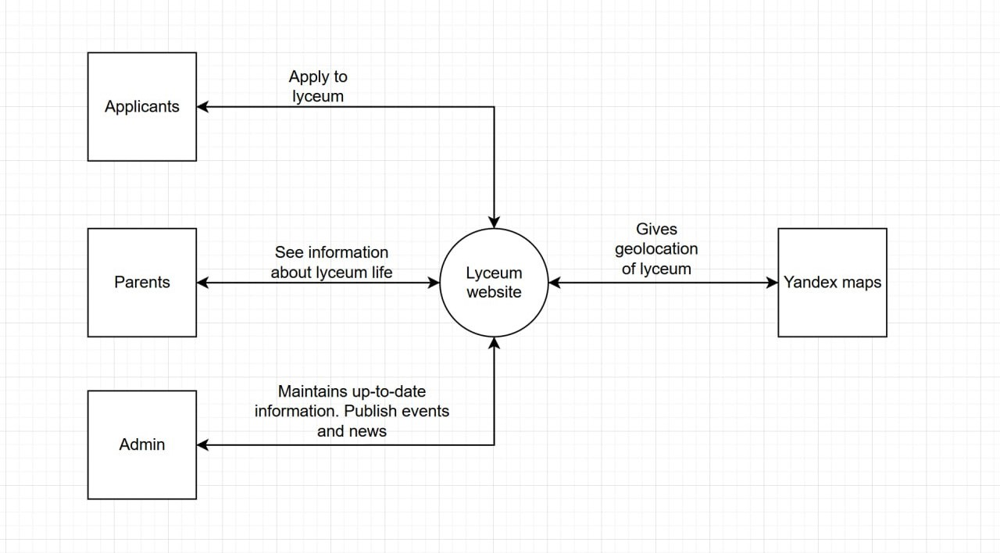

# Innolyceum


**Code is not allowed due to commercial use**

**CMS-powered website for Innopolis Lyceum to attract applicants, share updates, and present school life.**

[](https://lyceuminnopolis.ru/) 
[](https://drive.google.com/file/d/1yhPcfGIlradBXD36QMemuaKAoAm3P4wQ/view?usp=sharing) 
[](https://gitlab.pg.innopolis.university/p.khramov/innolyceum/-/pipelines)
[](LICENSE)
## 🎯 Project Goals

- Develop a custom CMS-powered website for Innopolis Lyceum.  
- Enhance the school’s online presence with a unique, user-friendly platform.  
- Attract applicants and clearly present the admission process.  
- Showcase life at the Lyceum, including staff, events, and news.  
- Enable easy content management for staff via a CMS (editable pages, news, events).

## 📄 Project Description

Innopolis Lyceum previously lacked a dedicated website that showcased its distinct identity and helped attract new students. The Innolyceum project delivers a purpose-built, CMS-powered platform designed to express the Lyceum’s values and unique character. Designed with usability and maintainability in mind, the website enables school administrators to effortlessly update content keeping the site fresh, relevant, and welcoming for prospective students and their families.

## 🗺 Project Context Diagram

This diagram shows the key stakeholders and external systems interacting with the Innolyceum website.



## ✅ Feature Roadmap Checklist

### Create Pages
- [x] Main Page
- [x] About Lyceum Page
- [x] Teacher Staff Page
- [x] Achievements Page
- [x] Education Programs Page
- [x] Schedule of the Day Page
- [x] Documents Page
- [x] For Applicants Page
- [x] News Page
- [x] Events Page
- [x] Sponsor Page
- [x] Contacts Page

### Connect CMS (Wagtail) to Pages
- [x] Main Page
- [x] About Lyceum Page
- [x] Teacher Staff Page
- [x] Achievements Page
- [x] Education Programs Page
- [x] Schedule of the Day Page
- [x] Documents Page
- [x] For Applicants Page
- [x] News Page
- [x] Events Page
- [x] Sponsor Page
- [x] Contacts Page 

### Testing and Documentation
- [x] Create unit and integration tests  
- [x] Write project documentation  

### Infrastructure and Deployment
- [x] Configure CI/CD pipeline  
- [x] Configure production server  
- [x] Integrate NGINX  
- [x] Integrate Redis for caching  
- [ ] Transfer the website to Customer's server
- [ ] Set up logging  

### Additional Features
- [ ] Implement mobile-responsive version of the website  
- [ ] Integrate U-Cassa payment tool  
- [ ] Enable collection and management of student data for paid courses (accessible by Lyceum staff)

## 🧩 Usage Instructions (for customer) | [Russian version](docs/russian-version-README/Инструкция по использованию.md)
#### Why this is important:
This guide provides essential instructions for both public visitors and administrative users of the website. It ensures that everyone — from casual site visitors to content managers — can access, navigate, and interact with the site effectively. Whether you're exploring the site or updating content, this guide outlines what you need to know.

### 🌐 Public User Access 


Once deployed, the site is available at:  
👉 [https://innolyceum.ddns.net](https://innolyceum.ddns.net)

Visitors can:

- Scroll through the main page with featured content
- Navigate to:

  - **О лицее** (About Lyceum), which includes:
    - Общая информация – General Information  
    - Педагогический состав – Teaching Staff  
    - Достижения – Achievements  

  - **Образование** (Education), which includes:
    - Образовательные программы – Educational Programs  
    - Распорядок дня – Schedule of the Day  
    - Документы – Documents  

  - **Поступающим** (For Applicants) – admission-related information

  - **Новости** (News) – view the latest updates

  - **Мероприятия** (Events) – view upcoming events

  - **Спонсорство** (Donation) – sponsorship details

  - **Контакты** (Contacts) – communication details

All pages are accessible via the website header or footer for a seamless browsing experience.

---

### 🔐 Admin Access (Content Editing)

Admins can manage content through Wagtail CMS:

1. Go to: [https://innolyceum.ddns.net/admin](https://innolyceum.ddns.net/admin)
2. Login with:
   - **Username**: `pavel`  
   - **Password**: `123`
3. After login:
   - Navigate to **"Страницы" (Pages)**
   - Open the **"Главная" (Main)** folder
   - Select a page to edit → update → save → publish

---

### ➕ Adding New Content

To add a new Event or News item:

1. In the admin panel, click the ➕ next to:
   - **"Мероприятия" (Events)**
   - **"Страница новостей" (News Page)**
2. Fill in the required fields
3. Click **Save** and **Publish**

The new content will appear immediately on the site.

## ⚙️ Project Installation and Deployment Instructions (for customer) | [Russian version](docs/russian-version-README/Инструкция по установке и развертыванию проекта.md)
#### Why this is important:
This section is crucial for developers or system administrators who need to install, configure, and run the website locally or on a server. It provides a step-by-step, reproducible guide using Docker to ensure consistent deployment across environments. Follow these steps to install and run the project using Docker.

### 1. Install Docker
Download and install Docker from the official website:  
https://www.docker.com/

### 2. Download the Project
Download the project archive from the repository:  
https://gitlab.pg.innopolis.university/p.khramov/innolyceum/-/tree/back_dev?ref_type=heads

### 3. Unarchive the Project
Extract the downloaded archive to a convenient folder on your computer.

### 4. Open a Terminal
- **Windows:** Open Command Prompt or PowerShell  
- **Linux:** Open your Terminal application

### 5. Navigate to the Project Directory
Change directory to the location where you extracted the project. For example:

```bash
cd path/to/your/unarchived/project
```
### 6. Start the application using Docker.
In the terminal, run the following commands:
```bash
docker compose up -d --build; docker compose logs -f web
```

### 7. Wait for the server to start.
Monitor the logs. When you see a line like this:
```bash
django  | [11/Jul/2025 12:53:22] "GET /metrics HTTP/1.1" 200
```
it means the server has started successfully.

### 8. Access the application.
Open your web browser and go to: https://localhost/


## 📁 Documentation
### 🛠 Development
See the [Contributing Guide](./CONTRIBUTING.md) for information on:

- Kanban board
- Git workflow
- Secrets management

### 📏 Quality Attributes & Scenarios

See the [Quality Attribute Scenarios](./docs/quality-attributes/quality-attribute-scenarios.md) documentation for detailed descriptions of quality characteristics and scenarios.

### 🧪 Quality Assurance
- **Automated Tests:** Detailed documentation can be found in [automated-tests.md](./docs/quality-assurance/automated-tests.md)  
- **User Acceptance Tests:** See [user-acceptance-tests.md](./docs/quality-assurance/user-acceptance-tests.md) for more information.


### 🤖 CI/CD Pipeline

- **Continuous Integration:** Details on our CI pipeline can be found in [continuous-integration.md](./docs/automation/continuous-integration.md)  
- **Continuous Deployment:** See [continuous-delivery.md](./docs/automation/continuous-delivery.md) for deployment automation.

### 🏛 Architecture

- **Overview & Tech Stack:** See [architecture.md](./docs/architecture/architecture.md) for a detailed description of the system architecture and technologies used.

- **Architecture Views:**
  - Static View: located in [`docs/architecture/static-view/`](./docs/architecture/static-view/)
  - Dynamic View: located in [`docs/architecture/dynamic-view/`](./docs/architecture/dynamic-view/)
  - Deployment View: located in [`docs/architecture/deployment-view/`](./docs/architecture/deployment-view/)
