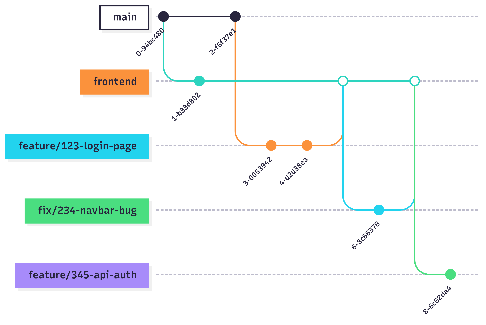

# Git workflow
We use a GitLab Flow–inspired workflow that combines feature branching with strong integration of issues, merge requests (MRs), and continuous integration (CI/CD). This ensures clean collaboration, traceability, and reliable deployments.

## 1. Creating Issues

All work begins with the creation of a GitLab issue. To ensure clarity, consistency, and alignment with the team’s workflow, the following entry criteria must be met before an issue is considered ready for development.

### Entry Criteria for New Issues:
- The backlog item was **groomed and reviewed** by the team or product owner.
- The issue was created using one of the approved templates:
  - **User_Story**
  - **Bug_Report**
  - **Technical_Task**
- The label **Prioritization** was added to indicate review for business value.
- A **Story Points** label (e.g., `1`, `3`, `5`, `8`, etc.) was assigned to estimate effort.
- The issue was added to the **current sprint** (GitLab milestone or board list).
- The label **To Do** was applied to reflect that the item is ready to be picked up.
- Ensure the issue has a **clear, descriptive title** and a complete body (filled via the selected template).

## 2. Labelling Rules

- Every issue **must have exactly one** of each:
  - **Priority** label: `Highest`, `High`, `Medium`, `Low`, or `Lowest`
  - **Story Point** label: one of `SP: 1`, `SP: 2`, `SP: 3`, `SP: 5`, `SP: 8`, `SP: 13`, `SP: 21`
  - **Status** label: `To Do`, `In Progress`, `In Review`, `User Testing`, `Ready To Deploy`, or `Done`

- Labels must be applied when the issue is created and updated as the issue progresses.

## 3. Assigning Issues

- New issues are **unassigned by default** unless there is a prior agreement that a specific team member will handle the issue.
- Team members **may assign issues to themselves** only when the issue appears in the `To Do` column on the Kanban board.
- Issues should only be assigned when the assignee is ready to start work or take ownership.

## 4. Creating, Naming, and Merging Branches

### Creating Branches
- Frontend developers create branches from the latest `FrontEnd` branch.
- Backend developers create branches from the latest `back_dev` branch.
- Always sync your base branch (`frontend` `back_dev` or `main`) before creating a new branch to avoid conflicts.

### Naming Branches
- Use these branch name formats:
  - `feature/<issue-id>-<short-description>` — for new features  
    *Example:* `feature/123-login-page`
  - `bugfix/<issue-id>-<short-description>` — for bug fixes  
    *Example:* `bugfix/234-fix-navbar`
- Use lowercase letters and hyphens to separate words.
- Keep descriptions concise and meaningful.

### Merging Branches
- Merge only via GitLab Merge Requests (MRs).
- Before merging:
  - Get at least one approval from a reviewer.
  - Update your branch with the latest changes from `FrontEnd` `back_dev`, or `main` as applicable.
- Delete branches after merging.

## 5. Commit Message Format

- Use the format: `<type>(<issue-id>): <short descriptive message>`
- Types include:
  - **feat**: Short for *feature*. Use when adding a new feature or functionality.
  - **fix**: Use when fixing a bug or incorrect behavior.
  - **docs**: For documentation-only changes, like updating README or comments.
  - **chore**: Routine tasks that don’t affect app behavior or add features (e.g., dependency updates, build script changes).
  - **refactor**: Code improvements or restructuring without adding features or fixing bugs (e.g., simplifying code, renaming variables).
- Always include the related GitLab issue ID (without `#`).
- Write messages in the imperative mood (e.g., “add,” not “added”).
- Keep the subject concise, ideally 50 characters or less.
- For longer explanations, separate the subject from the body with a blank line.
- Use the body to explain the why and how of the change.
- Examples:
  - `feat(123): add login form validation`
  - `fix(234): correct navbar dropdown behavior`
  - `docs(345): update README with installation steps`

## 6. Creating a Merge Request

To ensure consistency and traceability, follow these rules when opening a Merge Request (MR) for an issue:

- **Always create an MR from a feature or bugfix branch to the appropriate base branch** (`FrontEnd`, `back_dev`, or `main`).
- **Link the MR to the related issue** by mentioning it in the description (e.g., `Closes #123`).
- **Use the predefined Merge Request Template** to provide structured information.
  - [View MR template here](https://gitlab.pg.innopolis.university/p.khramov/innolyceum/-/blob/main/.gitlab/merge_request_templates/Default.md)

## 7. Code Reviews

- Every MR must be reviewed by at least one team member.
- Reviewer checks code quality, style, and issue linkage.
- Use comments for questions or required changes.
- Author must resolve comments before merging.

## 8. Merging Merge Requests

- MRs can be merged only after passing review and CI checks.
- After merging, move the related issue to **Ready To Deploy** or close it if complete.

## 9. Resolving Issues

- An issue is resolved only after its related MR is merged and tested.
- Move the issue to **Ready To Deploy** or **User Testing** as appropriate.
- Close the issue once verified in staging or production.
- Make sure labels and assignees are updated before closing.

## Git Workflow Diagram

